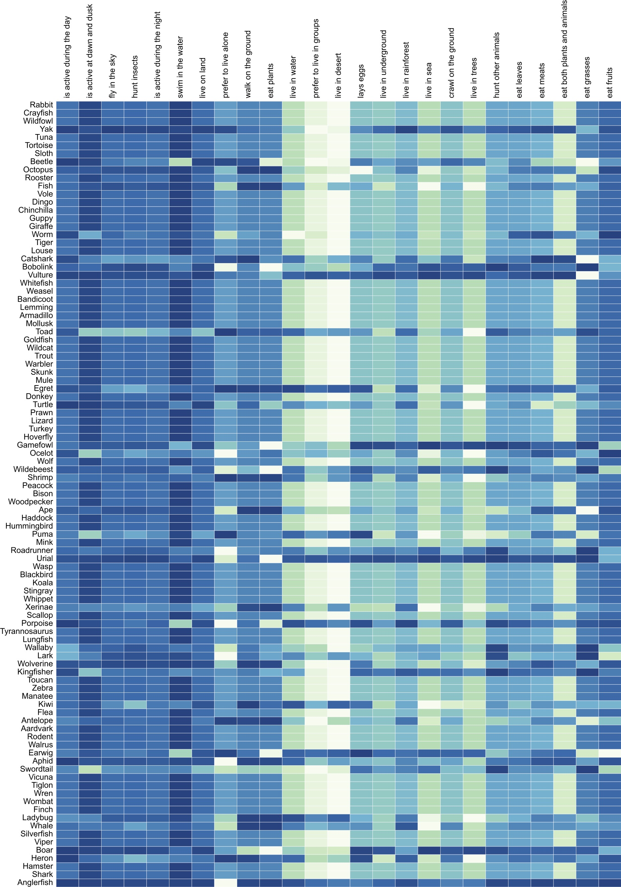
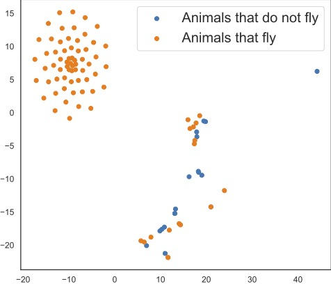
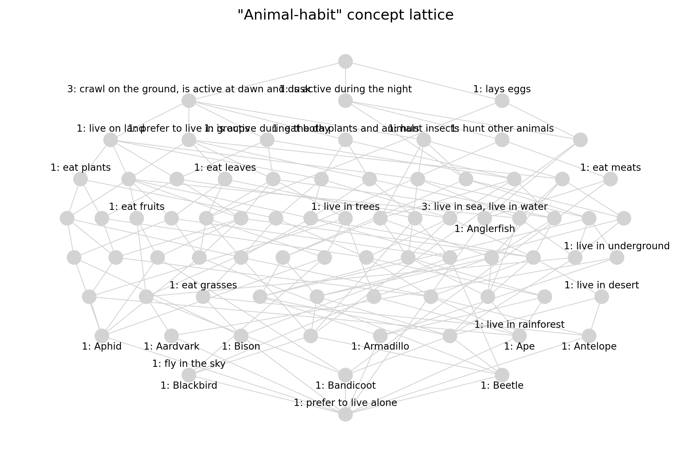
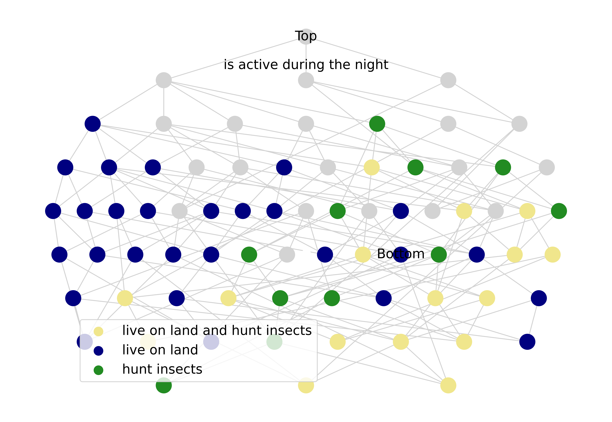

# BertLattice

This is the reproduction of [*From Tokens to Lattices: Emergent Lattice Structures in Language Models*](https://openreview.net/forum?id=md9qolJwLl).
# Setup
Prerequisites:
- python 3.9
- cuda 12.8

Install packages:
```bash
pip install -r requirements.txt
```

Run:
```bash
bash run.sh
```

<!-- ## Base Models (temporarily hidden)
- BERT
  - [paper](https://aclanthology.org/N19-1423/)
  - [github](https://github.com/google-research/bert)
  - [huggingface](https://huggingface.co/google-bert/bert-large-uncased)

- ModernBERT
  - [paper](https://arxiv.org/abs/2412.13663)
  - [github](https://github.com/AnswerDotAI/ModernBERT)
  - [huggingface](https://huggingface.co/collections/answerdotai/modernbert-67627ad707a4acbf33c41deb)
 
- DeBERTaV3
  - [paper](https://openreview.net/forum?id=sE7-XhLxHA)
  - [github](https://github.com/microsoft/DeBERTa)
  - [huggingface](https://huggingface.co/microsoft/deberta-v3-large)
-->

# Results
### Animal-Behavior
- *Formal context*:
  

- *T-SNE visualization of concept embeddings constructed from the formal context*:
  

- *Concept lattice reconstructed from the formal context*:
  

- *Highlighted paths for animals with pre-defined attributes “live on land”, “hunt insects”, and an implicit attribute “live on land and hunt insects”*:
  
